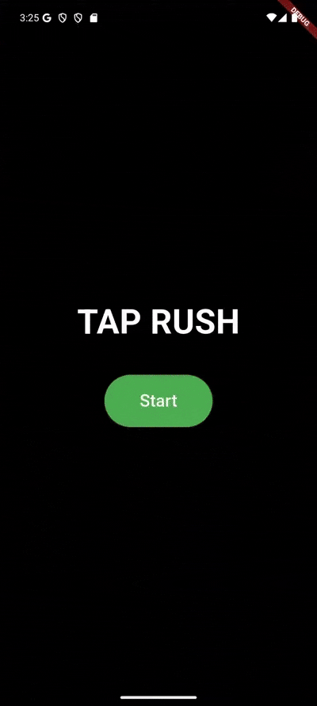

📱 Tap Rush Game – Flutter

A lightweight Tap Rush style mini-game built with Flutter, designed as a clean architecture reference project.
The project is fully modular, independent, and structured for learning, reuse, and scalability.

✨ Key Features

Clean Architecture (data / domain / presentation layers)

Provider for state management

Fully decoupled & reusable structure

Optimized game loop and UI updates

Zero jank during gameplay

Tested with Flutter Performance Overlay

No red frames observed during runtime

Smooth animations and responsive tap mechanics

Simple, extendable core suitable for other mini-games

🎯 Purpose

This project was created as:

A reference implementation of clean architecture in Flutter

A base project for mini-games or tap-based mechanics

An educational resource for developers who want maintainable and performant Flutter apps

🛠 Tech Stack

Flutter

Dart

Provider

Clean Architecture principles
